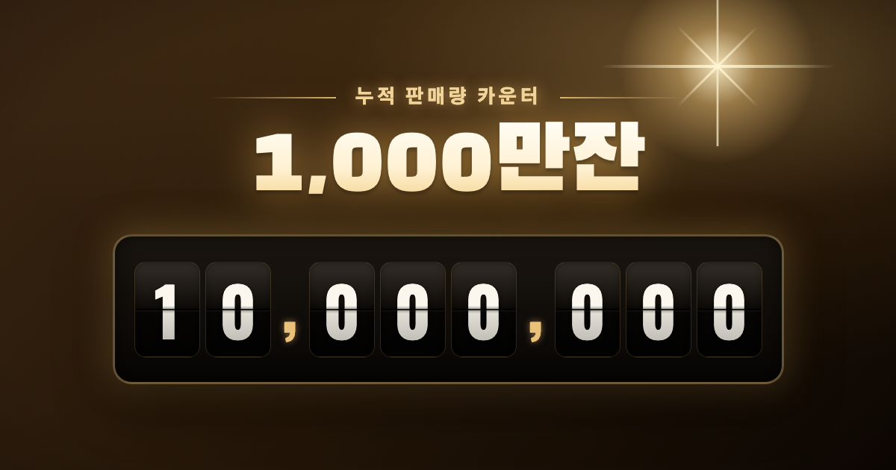

# 1000만잔 카운터 · OBS 오버레이

누적 판매량을 시네마틱 골드 오도미터로 카운트업하는 OBS용 카운터 오버레이입니다.



## 기능

- **오도미터 애니메이션** — 슬롯머신 스타일 릴 회전으로 목표 숫자까지 카운트업
- **목표 숫자 자유 설정** — 자릿수에 맞춰 보드가 자동으로 재구성 (최대 12자리)
- **타이틀 템플릿** — `{n}` 전체 숫자 · `{만}` ÷10,000 · `{억}` ÷1억 토큰 지원
- **화면 비율** — 16:9 · 9:16(세로) · 1:1 · 4:3
- **배경 모드** — 골드 씬 · 검정(Screen 블렌드) · 크로마키 그린
- **재생 길이 조절** — 2~12초, 반복 재생 옵션

## 사용법 (OBS)

1. 페이지를 열고 하단 바에서 목표 숫자·라벨·비율 등을 설정
2. `H` 키로 UI를 숨김
3. OBS에서 **브라우저 소스** 또는 **윈도우 캡처**로 추가
4. 화면 클릭 또는 `Space` 키로 다시 재생

## 로컬 실행

별도 빌드 없이 `index.html`을 브라우저에서 열면 됩니다.

```bash
open index.html
```

## 배포 (Vercel)

```bash
vercel --prod
```

배포 후 `index.html`의 `og:url` / `og:image` 주소를 실제 배포 URL로 변경하세요.

## 에셋

- `favicon.svg` — 골드 오도미터 파비콘
- `og-image.png` — 소셜 공유용 OG 이미지 (1200×630)
- `.og/og-image.html` — OG 이미지 재생성용 소스 (헤드리스 Chrome으로 스크린샷)
